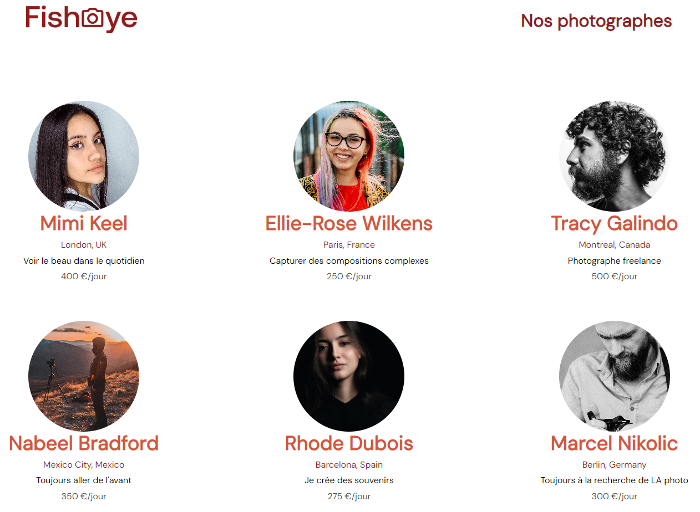

Openclassrooms Projet 4 : Créez un site accessible pour une plateforme de photographes - Site Fisheye

Le contexte du projet : 

 - Entreprise : site web de photographes freelance qui permet aux photographes indépendants de présenter leurs meilleurs travaux et d’être contacter.
 - Volonté de moderniser le site.
 - Les bases du site ont été commencées par une collègue appelée sur un autre projet.
 - Objectif : prendre le relais sur le développement et rendre le site dynamique et accessible.

 Cahier des charges : 

 - Spécifications techniques :
    - Utiliser des fichiers séparés pour le HTML, le CSS et le Javascript.
    - Balises sémantiques et commentaire du code si besoin. 
    - Utilisation exclusive de Javascript (pas de JQuery).
    - 2 maquettes et 2 modal à intégrer.
    - Responsive sur mobile non demandé.
- Spécifications fonctionnelles : 
    - Page d'accueil : le clic sur le portrait du photographe mène à sa page personnelle.
    - Page du photographe : 
        - Affiche la galerie des travaux du photographe : photo et vidéo.
        - Possibilité de liker chaque média, un total est affiché.
        - Possibilité de tri : date, titre ou popularité.
        - Lightbox : le clic sur un média ouvre une vue rapprochée.
        - Mise en place d’une modale de contact.
    - Accessibilité : répondre aux besoins d'accessibilité :
        - Navigation.
        - Contraste.
        - Description alternative.

